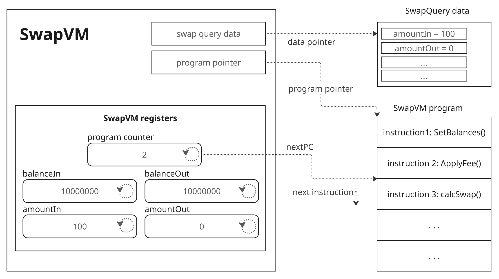
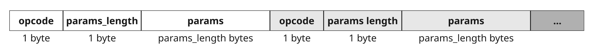

Version: Developer Preview 1.0 
Repository: <https://github.com/1inch/swap-vm>

# Introduction

Modern AMMs and DEXes provide extensive functionality and have reached significant maturity, yet their architecture still has room for improvement. One challenge newer DEX versions aim to address is the abstraction of mathematical models and the settlement layer. Progress in this direction can be observed in Uniswap V4 and Balancer V3, where swap settlement and amount calculations are clearly separated. This separation increases code efficiency and composability, but further advancements are needed.

A notable case illustrating these composability challenges is the "quoting" of AMM states, which involves simulating swaps and is often utilized by market makers. This "quoting" can be complex, particularly when swap logic includes prior states, dependency on input/output amounts, or other intricacies.

These challenges complicate the development of new AMM strategies. Developers are forced to spend significant effort writing infrastructure code instead of focusing on mathematical models. Even minor errors in such infrastructure can lead to severe vulnerabilities, as demonstrated by numerous cases where minor DEX code changes resulted in critical protocol breaches.

# 1inch SwapVM

To solve these issues, we developed SwapVM: a universal, composable EVM execution engine for swap operations. SwapVM enables the creation of various AMMs without requiring developers to implement infrastructure from scratch, instead allowing them to focus solely on swap mechanics and conditions, using well-audited and thoroughly vetted basic operations at its core. SwapVM fulfills the following requirements:

- Compose swap logic using pre-built execution blocks.

- Provide ready-to-use components for most current swap models.

- Include tools for token and balance operations.

- Deliver 100% accurate swap quoting.

- Enable reuse, serialization, and identification of any SwapVM program.

- Maximize gas efficiency.

A specialized virtual machine is the ideal way to implement this. Conceptually, it functions like a processor unit that executes instructions sequentially, where each operation performs calculations, logical operations, controls execution flow, or interacts with external systems. Analogous to a CPU, SwapVM includes arithmetic, logic, control flow, and input/output instructions.

The implications of this approach are substantial. Programs composed of instructions can be serialized and identified by their bytecode hash. Instructions can be individually audited, while universal quoting ensures consistent execution across all programs. Moreover, this design supports formal verification of SwapVM programs and facilitates the development of ZKP provers and verifiers for them.

SwapVM does not create monolithic, "all-in-one" DEXes. Instead, it enables the rapid development of numerous specialized, granular, and composable AMMs that adapt quickly to market conditions. When integrated with 1inch’s Aqua shared liquidity layer, SwapVM can establish markets with thousands of small, specialized AMMs that can be dynamically created and removed based on market needs, transforming the DEX landscape significantly.

# Protocol design

## Generic scheme

<figure id="fig:swapvm-generic" data-latex-placement="t">

<figcaption>SwapVM Architecture and Execution Flow</figcaption>
</figure>

<figure id="fig:swapvm-bytecode" data-latex-placement="b">

<figcaption>SwapVM Bytecode</figcaption>
</figure>

The schematic on Figure <a href="#fig:swapvm-generic" data-reference-type="ref" data-reference="fig:swapvm-generic">1</a> outlines the SwapVM execution flow (omitting several internal implementation details). At its core, SwapVM utilizes a set of registers holding the current swap state (e.g., balanceIn, balanceOut, amountIn, amountOut) for the processed tokens. A program counter indicates which instruction will execute next. During initialization, SwapVM reads from a read-only SwapQuery data structure containing the swap’s details, sets the program counter to the first instruction, and begins execution.

## SwapVM program

<figure id="fig:swapvm-runloop" data-latex-placement="t">

<figcaption>SwapVM nested runLoop()</figcaption>
</figure>

Instructions sequentially interact with the swap registers and update them. Instructions may also modify the program counter based on specific conditions (control instructions). Every instruction is composed of an opcode, referring to an execution bytecode (implemented as EVM functions), and parameters. Each opcode is accompanied by its parameters in the bytecode, and parameter length is determined during execution. For instance, the fee size in basis points is a parameter for the flatFee() instruction, included in the bytecode. All SwapVM instructions share a unified interface and operate within the SwapVM context. Some take input arguments, while others are purely computational.

The structure of SwapVM’s bytecode is illustrated in Figure <a href="#fig:swapvm-bytecode" data-reference-type="ref" data-reference="fig:swapvm-bytecode">2</a>.

Execution begins with the swap() function, which first verifies signatures (SwapVM is compatible with all modern off-chain signature types) and configures token operation functions. After initializing the SwapVM context and loading initial values into registers, execution moves to the runLoop() procedure. This modular approach allows nested execution, enabling instructions with "wrapping" logic. For example, a progressive fee that scales with swap volume or price impact might initialize fee parameters, calculate swap amounts, and then apply the fee. This process is illustrated in Figure <a href="#fig:swapvm-runloop" data-reference-type="ref" data-reference="fig:swapvm-runloop">3</a>.

Each SwapVM program can combine instructions to implement almost any logic that interacts with available balances or specified token amounts. Some instructions operate with single tokens, using these “1D” instructions, SwapVM can handle signed order parameters, perform validations, and settle balances for Limit Orders functionality. Other instructions operate with two or more tokens. By using these “2D” and “XD” operations, SwapVM processes the states of multiple tokens, supporting AMMs and other multi-token strategies. “2D” instructions are distinguished because two-token functions are commonly used in AMMs and are sometimes more compact and efficient than their “XD” versions.

# SwapVM instructions

Below is an overview of SwapVM’s core instructions; detailed specifications will be covered in the technical documentation. The instruction set described here will expand in future releases of SwapVM. Additionally, some helper and debugging instructions, which assist in developing SwapVM programs, have been omitted for brevity.

## Balances

These instructions handle SwapVM balances/amounts registers. They accept arrays of token addresses and balances, storing/loading them to/from the SwapVM context. Instructions include:

- `_staticBalancesXD()` sets the swap context’s ‘balanceIn‘ and ‘balanceOut‘ from provided initial balances

- `_dynamicBalancesXD()` manages balances that persist across multiple swaps and get updated after each swap

## Controls

This group of instructions is used for conditional jumps, enabling restrictions or conditional logic in SwapVM programs. Instructions include:

- `_jumpIfTokenIn()` jumps if the input token matches a specified token

- `_jumpIfTokenOut()` jumps if the output token matches a specified token

- `_onlyTakerTokenBalanceNonZero()` validates that the taker (the person executing the swap) holds at least some amount of a specified token

- `_onlyTakerTokenBalanceGte()` validates that the taker holds at least a minimum amount of a specified token

- `_onlyTakerTokenSupplyShareGte()` validates that the taker holds at least a certain percentage of the token’s total supply

These are crucial for limit order processing, ensuring they are fulfilled only when specific conditions are met. They can also enable conditional swaps, such as comparing swap outcome variants or fee structures.

## External call

The `_extruction()` instruction allows the SwapVM program to perform an external call, effectively integrating external logic of almost any complexity. This extends SwapVM’s functionality and enables integration with DeFi protocols. However, this instruction demands careful handling to ensure security. A typical use case would be incorporating external oracle prices for swaps, as seen in the next instruction set.

## Limit order related

These instructions focus on single-token operations, supporting SwapVM in fulfilling limit orders with various parameters. Instructions include:

- `_baseFeeAdjuster1D()` dynamically adjusts swap prices based on network gas costs

- `_dutchAuctionBalanceIn1D()` applies time-based exponential decay to reduce the required input amount

- `_dutchAuctionBalanceOut1D()` applies time-based exponential decay to increase the output amount

- `_requireMinRate1D()` enforces a minimum exchange rate for the swap

- `_adjustMinRate1D()` adjusts swap amounts to meet a minimum exchange rate

- `_invalidateBit1D()` invalidates an order using a bitmap-based system

- `_invalidateTokenIn1D()` tracks and limits the total amount of input token that can be filled for an order

- `_invalidateTokenOut1D()` tracks and limits the total amount of output token that can be filled for an order

- `_limitSwap1D()` executes a basic limit order swap at a fixed rate

- `_limitSwapOnlyFull1D()` executes a limit order that must be filled completely (all-or-nothing)

- `_oraclePriceAdjuster1D()` adjusts swap prices to match Chainlink oracle prices within safe bounds

They deal with adjusting or restricting in/out amounts based on limit order conditions or external oracle prices, facilitating the implementation of functionality such as 1inch’s Fusion protocol.

## Swap and AMM

These instructions implement various swap types. Examples include:

- `_xycSwapXD()` implements a constant product AMM swap (`x * y = k`);

- `_xycConcentrateGrowPriceRangeXD()` adjusts balances to concentrate liquidity within a price range (works with multiple tokens). Fees widen the range;

- `_xycConcentrateGrowPriceRange2D()` adjusts balances to concentrate liquidity within a price range (optimized for 2 tokens). Fees widen the range;

- `_xycConcentrateGrowLiquidityXD()` adjusts balances to concentrate liquidity within a price range (works with multiple tokens). Fees are reinvested in the liquidity;

- `_xycConcentrateGrowLiquidity2D()` adjusts balances to concentrate liquidity within a price range (optimized for 2 tokens). Fees are reinvested in the liquidity.

They calculate the in/out amounts for swaps using mathematical models like constant product or concentrated liquidity. As the core of SwapVM-based AMMs, these instructions combine with others to configure elements like swap fees or spread decay. They enable the construction of modern AMMs, particularly 1inch’s Aqua functionality, which supports detailed AMM structures with shared liquidity.

## Fees

Fee instructions configure and apply various fee structures to in/out amounts, enabling AMMs with flexible fee models. Examples include:

- `_flatFeeAmountInXD()` applies a flat percentage fee to the input amount

- `_flatFeeAmountOutXD()` applies a flat percentage fee to the output amount

- `_progressiveFeeInXD()` applies a progressive fee to the input amount based on swap size relative to pool balance

- `_protocolFeeAmountOutXD()` applies a progressive fee to the output amount based on swap size relative to pool balance

- `_protocolFeeAmountOutXD()` applies a flat fee on output amount and transfers it to a protocol address

- `_aquaProtocolFeeAmountOutXD()` applies a flat fee on output amount and transfers it to a protocol address using aqua’s protocol `push()` function

The logic for applying fees varies, depending on whether the fees are applied before or after swaps, to "in" or "out" amounts, and based on factors like swap amounts or price impact.

# SwapVM and 1inch Aqua protocol

The combination of Aqua’s shared liquidity layer and SwapVM is highly powerful. Aqua enables LPs to provide liquidity to multiple SwapVM AMMs without locking funds in each AMM. These AMMs can be freely deployed and removed based on current market conditions, allowing LPs to implement any strategy they choose. They can provide concentrated liquidity, use concurrent fees, and operate in low-liquidity token markets without needing to lock reserves for long-tail assets.

SwapVM fully supports Aqua’s balance settlement, enabling LPs to create multiple AMMs without locking their funds, while for users, these will appear as regular AMMs where each swap draws actual tokens from the LPs’ balances. This resolves the issue of fragmented liquidity in the AMM market, allowing LPs to compete for users by lowering fees and applying more sophisticated logic in their AMMs, rather than being limited to one or two AMM variants available on the market. The concept of Aqua AMMs is detailed in Aqua’s whitepaper.

# Conclusion

SwapVM enables the development of programmable and composable swap programs covering most AMM and limit order functionalities. Operating as an EVM-based virtual machine, SwapVM separates financial logic from token operations, freeing DeFi developers from the burden of building complex infrastructure. Developers can instead focus on mathematical and financial logic, encapsulated in compact, portable bytecode.

When paired with 1inch’s Aqua’s shared liquidity layer, SwapVM unlocks diverse DeFi strategies for LPs while enabling users to benefit from more competitive AMM systems. This integration significantly improves capital efficiency by consolidating fragmented liquidity across markets, while increasing competition in DeFi through flexible fee structures and innovative AMM strategies.